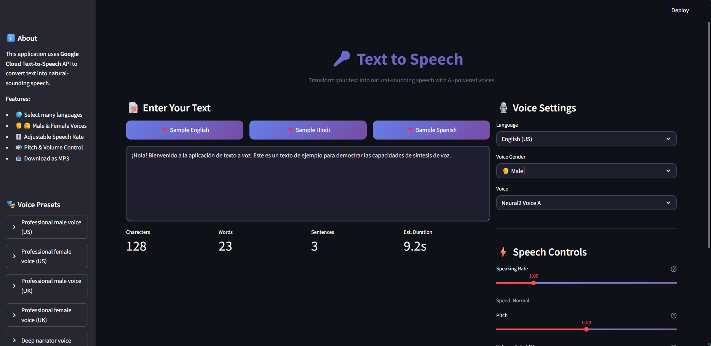
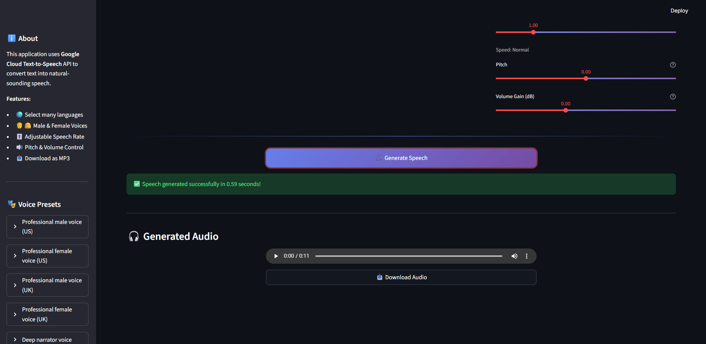

# 🎤 Text-to-Speech Application

A beautiful, feature-rich Text-to-Speech (TTS) web application built with Python and Streamlit, powered by Google Cloud's advanced Neural2 text-to-speech technology.

<div align="center">
  
  
</div>

## ✨ Features Implemented

The project successfully implements all the requested features:

### 1️⃣ Basic TTS Functionality

- **Google Text-to-Speech Integration**: Uses Google Cloud's advanced API for high-quality audio.
- **Audio Conversion**: Converts text input into speech and automatically saves it as an MP3 file.

### 2️⃣ Voice Customization

- **Voice Selection**: Users can choose between **Male** and **Female** voices.
- **Accents & Languages**: Support for multiple accents (US, UK, Indian, etc.) and languages.

### 3️⃣ Speech Rate & Volume Control

- **Adjustable Settings**: Simple UI sliders to control **Speaking Rate** (0.25x - 4.0x), **Pitch**, and **Volume**.
- **Real-time Customization**: settings are applied before generating the speech.

### 4️⃣ Text Input Validation

- **Robust Validation**: Handles special characters, removes emojis, and formats text for optimal speech synthesis.
- **Unit Tests**: Includes comprehensive unit tests (`tests/test_text_validator.py`) to verify validation logic.

### 5️⃣ Web Application Integration

- **Streamlit Web App**: A user-friendly web interface for text input and control.
- **Browser Playback**: Listen to the generated audio directly within the browser.
- **Download Option**: One-click button to download the generated audio file.

## 🛠️ Prerequisites

Before you begin, ensure you have the following installed:

1.  **Python 3.8 or higher**: [Download Python](https://www.python.org/downloads/)
2.  **FFmpeg**: Required for audio processing.

    - **Windows (Easy Install via Winget)**:
      Open PowerShell and run:
      ```powershell
      winget install Gyan.FFmpeg
      ```
      _Note: Restart your terminal after installing to update your system PATH._

## 🔑 Google Cloud Setup (Important)

This application requires a Google Cloud Service Account to function.

1.  **Create a Google Cloud Project**: Go to the [Google Cloud Console](https://console.cloud.google.com/) and create a new project.
2.  **Enable API**: Search for "Text-to-Speech API" and enable it for your project.
3.  **Create Credentials**:
    - Go to **IAM & Admin > Service Accounts**.
    - Click **Create Service Account**.
    - Give it a name (e.g., `tts-app`) and grant it the **Cloud Text-to-Speech API User** role.
    - Click on the created service account, go to the **Keys** tab, and click **Add Key > Create new key**.
    - Select **JSON** and download the file.
4.  **Save Credentials**:
    - Rename the downloaded file to `credentials.json`.
    - Place it directly inside the project folder (same folder as `app.py`).

## 📦 Installation

1.  **Clone or Download** this project to your computer.
2.  **Open a Terminal** (Command Prompt or PowerShell) in the project folder.
3.  **Install Dependencies**:
    ```bash
    pip install -r requirements.txt
    ```

## 🚀 How to Run

1.  Make sure your `credentials.json` is in the project folder.
2.  Run the Streamlit app:
    ```bash
    streamlit run app.py
    ```
3.  The application will open automatically in your web browser (usually at `http://localhost:8501`).

## ❓ Troubleshooting

**"Credentials file not found"**

- Ensure you have renamed your downloaded JSON key to `credentials.json`.
- Verify it is located in the root directory of the project (alongside `app.py`).

